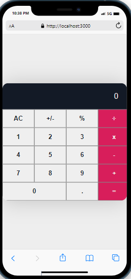

# Getting Started with Create React App

This project was bootstrapped with [Create React App](https://github.com/facebook/create-react-app).

## Available Scripts

In the project directory, you can run:

### `npm start`

<!-- Feel Free to Add, Update, Delete Any Section you find needs so -->

# Math Magicians

> This is a simple react project that contain a single page application (SPA) And a simple caculator to make some calculation and there is a section you can see some Math quotes. Ⓜ💯

<<<<<<< HEAD
## Video Demo 📽

https://user-images.githubusercontent.com/58553711/154146664-16b06368-8ca6-4deb-8282-b995f29d2801.mp4

=======
<!--  -->
## Video Demo 📽

>>>>>>> 5456eb5d20f600e265a429f949eabb4f55cf28d0

## Built With

- Languages: _**HTML, CSS, JavaScript Reactjs**_
- Frameworks: _**N/A**_
- Technologies used: _**GIT, GITHUB, LINTERS**_

## Additional tools
 - Google fonts
 - Webpack 

<!-- 
 ## Live Demo

[See My project Live here]()  -->

## Authors

<!-- Only Change Username for Different Accounts -->

👤 **Reem**

 Platform | Badge |
 --- | --- |
 **GitHub**  | [@Reem-lab](https://github.com/Reem-lab)
 **Twitter** | [Rem79940127](https://twitter.com/Rem79940127)
 **LinkdIn** | [reem-janina](https://www.linkedin.com/in/reem-janina-ab74ab21a/)

## 🤝 Contributing

Contributions, issues, and feature requests are welcome!

Feel free to check the [issues page](https://github.com/MrRamoun/WEBDEV/issues).

## Show your support

Give a ⭐️ if you like this project!

## Acknowledgments

- Hat tip to anyone whose code was used
- Inspiration
- etc

## 📝 License

This project is [MIT](/LICENSE) licensed.
